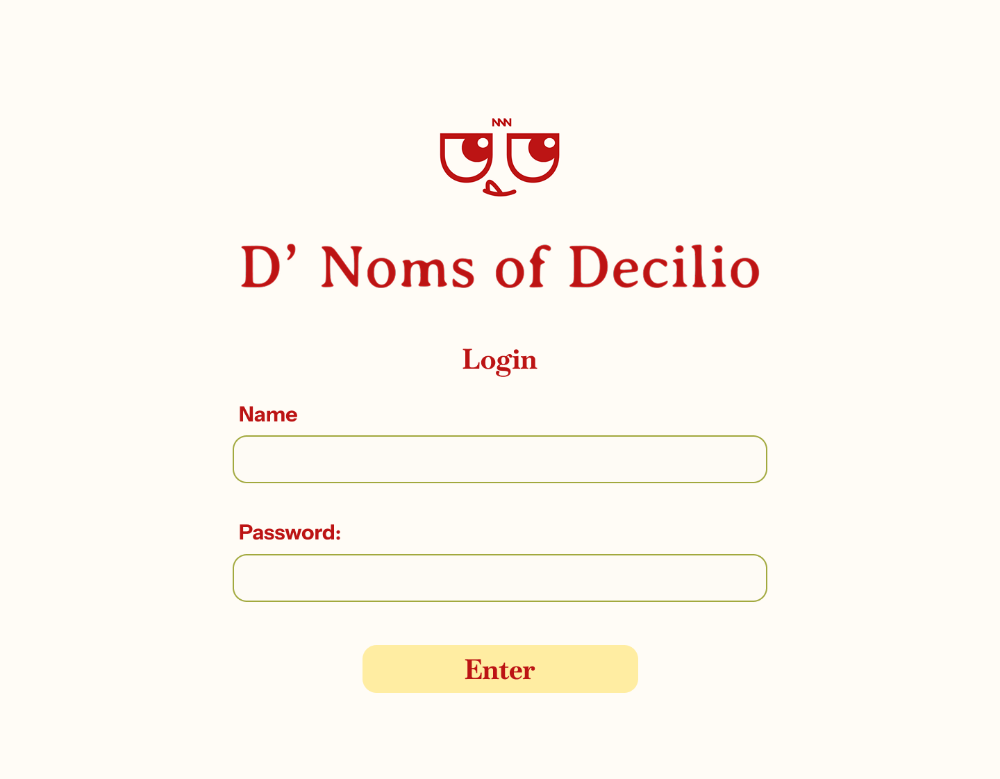
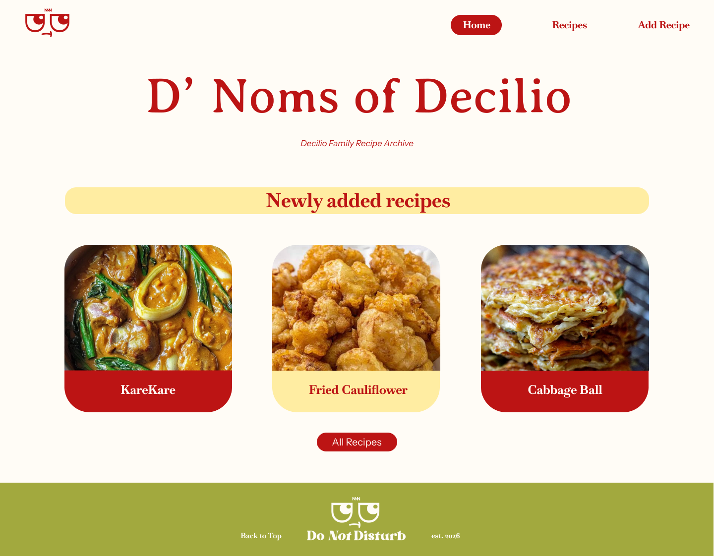
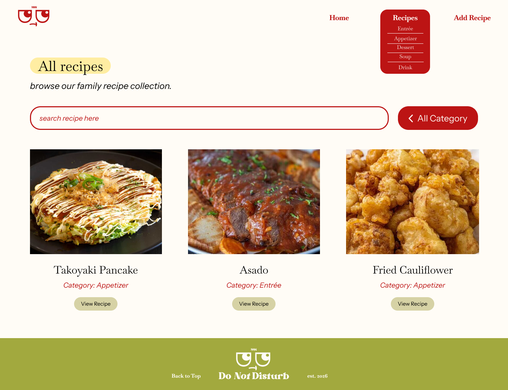
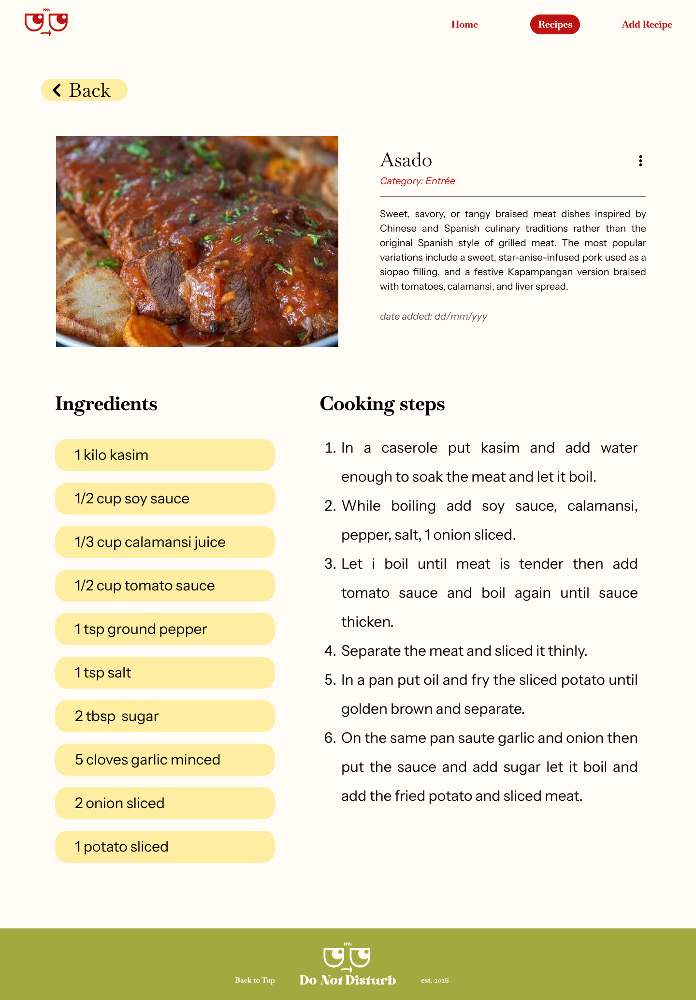
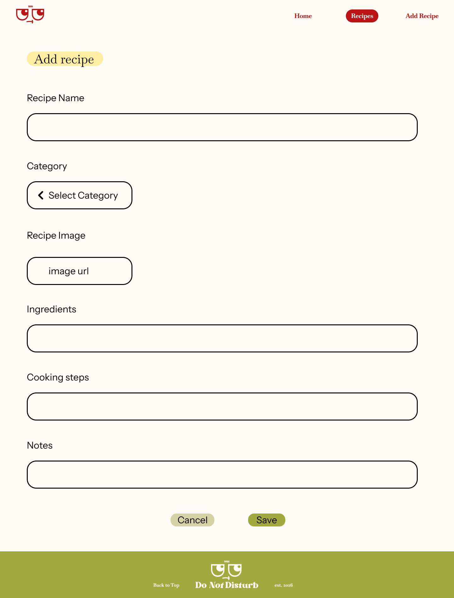
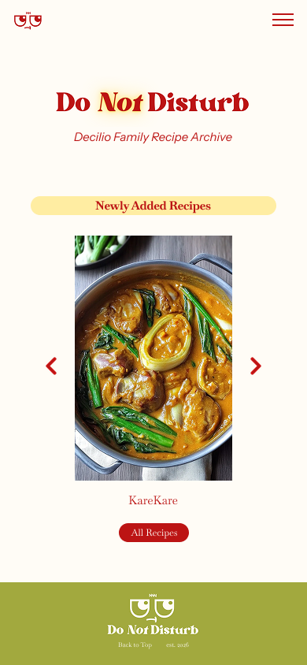
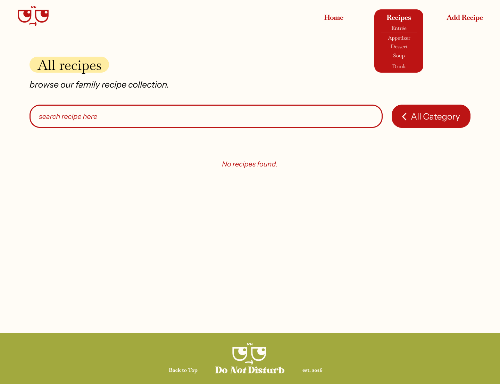

# Mockup

The mockup shows the visual design of the D' Noms of Decilio (DND) family recipe archive based on the planned high-fidelity design. It uses the project's actual colors, typography, spacing, content, navigation, recipe cards, and form layouts.

The mockup currently includes the following screens:

- Login
- Home
- All Recipes
- Recipe Details
- Add Recipe / Edit Recipe

## Screens

### Login

The login screen provides a simple entry point to the recipe archive. It includes the DND logo, project name, username/name field, password field, and an Enter button.

### Home

The Home page introduces the D' Noms of Decilio recipe archive and displays the three newly added recipes. It also provides access to the full recipe collection.

### All Recipes

The Recipes page displays the family recipe collection. It includes recipe search, category filtering, recipe cards, and navigation to individual recipe details.

The category navigation includes:

- Entrée
- Appetizer
- Dessert
- Soup
- Drink

### Recipe Details

The Recipe Details page displays the selected recipe's image, name, category, description, date added, ingredients, and cooking steps. It also includes navigation back to the recipe collection.

### Add / Edit Recipe

The Add/Edit Recipe screen provides the form needed to create or update a recipe. It includes fields for the recipe name, category, recipe image, ingredients, cooking steps, and notes, along with Cancel and Save actions.

## Visual Design

The mockup follows the visual direction established for DND:

- Warm off-white background
- Red as the primary color
- Light yellow for highlighted sections and controls
- Olive green for the footer
- Rounded recipe cards and buttons
- Serif typography for major headings and recipe content
- Simple, spacious layouts
- Consistent navigation and footer across the main pages

The design is intended to feel simple, warm, and personal, matching the idea of a family recipe archive rather than a public recipe-sharing platform.

## Responsive Design

A mobile version of the mockup is still to be added. The final design will include a mobile navigation layout with a hamburger menu and responsive recipe cards and content.

## Empty State

An empty state is also still to be added to the mockup. This will represent a situation where no recipes match the current search or category filter.

## Mockup vs. Final Application

The mockup represents the initial visual design of the application. During implementation, some visual details were refined to improve the overall appearance and consistency of the interface. For example, the recipe cards on the Recipes page were given borders in the final application because the updated design looks cleaner and helps separate each recipe more clearly.

These changes are only visual refinements. The main functions and features shown in the mockup remain the same and were not changed.